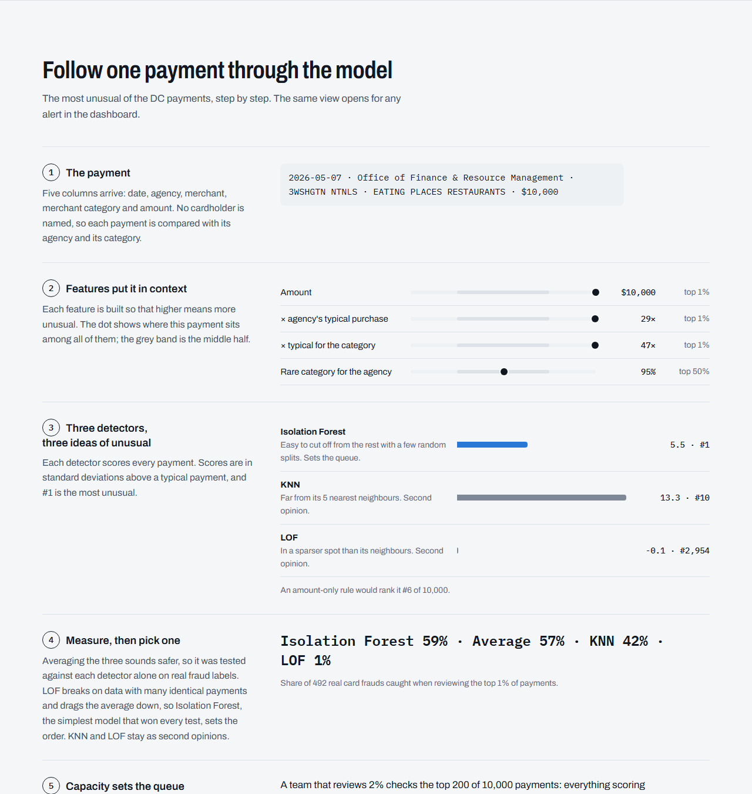
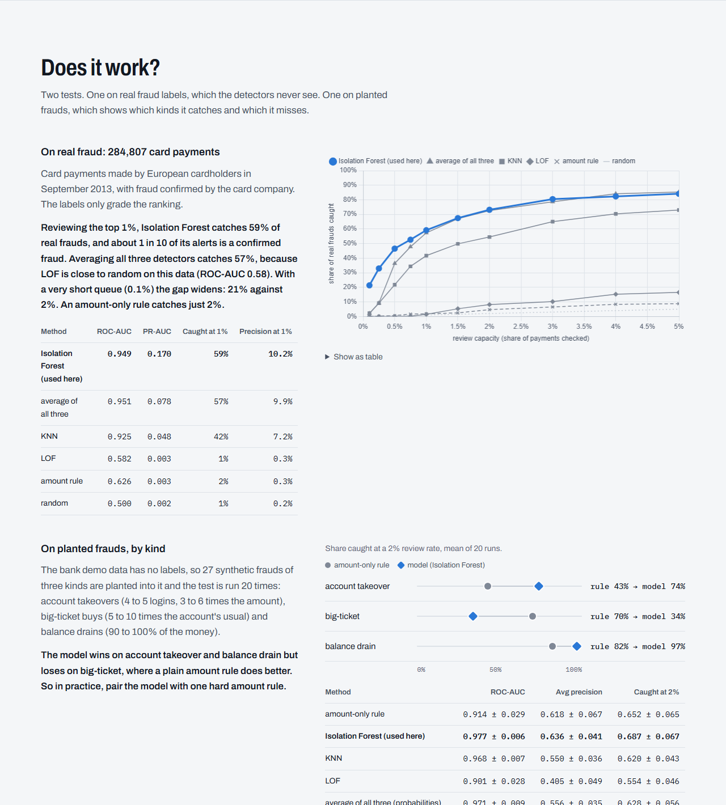
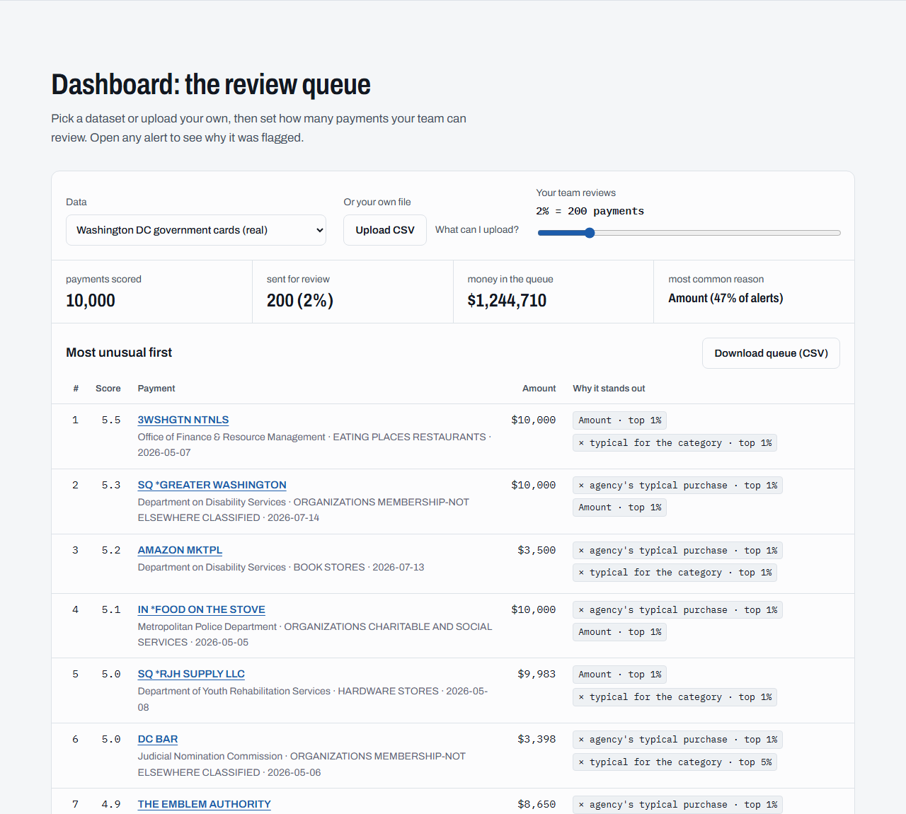

# Transaction Anomaly Detector

[](https://github.com/nightraven4545/bank-transaction-anomaly-detection/actions/workflows/ci.yml)
[](https://bank-transaction-anomaly-detection.vercel.app)

**Live: [bank-transaction-anomaly-detection.vercel.app](https://bank-transaction-anomaly-detection.vercel.app)**

The detector ranks payments by how unusual they are and explains every alert in plain words. It sizes the review queue to what a fraud team can actually check, and it never needs a fraud label.

It is tested on real data:
- **284,807 real card payments with 492 confirmed frauds.** Reviewing the top 1% catches **59% of the frauds, 59 times what random checks find**. The model never sees a label.
- **A real Czech bank's ledger.**
- **Washington DC's public government card spending**, scored live.


Started from DataCamp's guided project [*Detecting Anomalous Transactions*](https://www.datacamp.com/projects/2755), then taken further: real data, a real-label evaluation, a measured model choice, reason codes and a public dashboard.

## What the site shows
1. **A haystack:** each of 10,000 recent DC government card payments is a square. The 2% a review team would check first are red.
2. **One payment, step by step:** the most unusual DC payment goes through the whole pipeline. It's a $10,000 restaurant bill from the Office of Finance & Resource Management, 47 times the typical restaurant purchase.
3. **A dashboard:**
   - Pick a dataset or upload your own CSV (including an Indian bank statement), and set the review capacity.
   - Open any alert to see why it was flagged.
   - Download the queue.
4. **Results:** the real-label test, the planted-fraud test, and the evidence behind the model choice.
5. **Data, limits and responsible use:** where every dataset comes from, what each result does and does not prove, and how the alerts should be used.



## Results

### On real fraud labels
The [ULB / Worldline credit-card data](https://www.openml.org/d/1597) has 284,807 card payments by European cardholders (September 2013), 492 of them confirmed fraud. The detectors never see the labels; the labels only grade the ranking.

| method | ROC-AUC | PR-AUC | frauds caught at 1% | precision at 1% |
|---|---|---|---|---|
| **Isolation Forest** *(used in the app)* | 0.949 | **0.170** | **59%** | **10.2%** |
| average of all three detectors | 0.951 | 0.078 | 57% | 9.9% |
| KNN | 0.925 | 0.048 | 42% | 7.2% |
| LOF | 0.582 | 0.003 | 1% | 0.3% |
| amount-only rule | 0.626 | 0.003 | 2% | 0.3% |
| random | 0.500 | 0.002 | 1% | 0.2% |

In a 0.1% queue, Isolation Forest catches 21% of frauds. The average of all three catches 2%.

### On planted frauds, by kind
The bank demo data has no labels. So 27 synthetic frauds of three kinds are planted into its 2,512 real rows, and the test runs 20 times (mean ± sd):

| method | ROC-AUC | avg precision | caught at 2% |
|---|---|---|---|
| amount-only rule (robust z) | 0.914 ± 0.029 | 0.618 ± 0.067 | 0.652 ± 0.065 |
| **Isolation Forest** *(used in the app)* | **0.977 ± 0.006** | **0.636 ± 0.041** | **0.687 ± 0.067** |
| KNN | 0.968 ± 0.007 | 0.550 ± 0.036 | 0.620 ± 0.043 |
| LOF | 0.901 ± 0.028 | 0.405 ± 0.049 | 0.554 ± 0.046 |
| average of all three (probabilities) | 0.971 ± 0.009 | 0.556 ± 0.035 | 0.628 ± 0.056 |
| average of all three (z-scores) | 0.976 ± 0.007 | 0.613 ± 0.055 | 0.670 ± 0.061 |

Share of each kind caught at 2%, Isolation Forest against the amount-only rule:

| kind | amount-only rule | Isolation Forest |
|---|---|---|
| account takeovers | 43% | 74% |
| big-ticket purchases | 70% | 34% |
| balance drains | 82% | 97% |



### Key findings
- **Measure before you ensemble.** Averaging three detectors sounds safer, so it was the original design. The measurements say otherwise.
  - LOF breaks on data with many identical payments: on the card data it is close to random (ROC-AUC 0.58) and drags the average down.
  - Isolation Forest has the best PR-AUC and catch rate on the real labels, and the best scores on the planted test.
  - So Isolation Forest sets the queue, and KNN and LOF stay on the page as second opinions. Both comparisons are rebuilt by `report.py`.
- **The model and a simple rule catch different fraud.** The model wins on account takeovers and balance drains. A plain amount rule wins on big-ticket purchases. In practice, pair them.
- **Flag by review capacity, not by a probability cut-off.** "Outlier probability > 0.75" would send 327 of 2,512 demo transactions to review. The top 2% is 50, a queue a team can work through.

## Data
| dataset | real? | labels | used for | licence |
|---|---|---|---|---|
| [Washington DC purchase-card transactions](https://opendata.dc.gov/datasets/DCGIS::purchase-card-transactions), newest 10,000 (8 Apr to 31 Jul 2026), `data/dc_pcard.csv` | real | none | hero, walkthrough, dashboard | CC BY 4.0, District of Columbia (Office of Contracting and Procurement) |
| [PKDD'99 Czech bank ledger (Berka)](https://relational.fel.cvut.cz/dataset/Financial), full histories of 40 random accounts, `data/czech_bank_sample.csv` | real, anonymised | none | dashboard | no explicit licence; released for the PKDD'99 Discovery Challenge and mirrored for research since. Cited, sample only. |
| [ULB / Worldline credit-card fraud](https://www.openml.org/d/1597) | real, anonymised (PCA) | 492 frauds | results | ODbL / DbCL. Downloaded at build time, never committed. Dal Pozzolo et al., 2015 |
| [Bank Transaction Dataset for Fraud Detection](https://www.kaggle.com/datasets/valakhorasani/bank-transaction-dataset-for-fraud-detection) (Vala Khorasani), `data/bank_transactions_data_2.csv` | synthetic | none | planted-fraud test, the original DataCamp project | [Apache-2.0](data/LICENSE) |
| your own CSV, uploaded on the site | yours | none | dashboard | scored in memory, never stored |

**Why there's no "real bank fraud" dataset here:**
- Banks are bound by secrecy and data-protection law: India's DPDP Act 2023, the EU's GDPR and the US GLBA.
- Even anonymised payment trails can identify people from a few dates and shops.
- Fraud labels teach fraudsters what gets caught.

So public data is either old and anonymised (Berka), obscured (the ULB card data), published by a government about its own spending (DC), or synthetic. This project uses one of each and says which is which.

The Kaggle demo data has three data-quality problems, which is why it only uses behavioural features:
- Every transaction happens between 16:00 and 18:59.
- `PreviousTransactionDate` is later than the transaction on every row.
- 98% of repeat customers use a new device every time.

Age and occupation are never features.

## How it works
`detect.py` holds one feature recipe per kind of data. Every feature is built so that higher means more unusual:

| recipe | data | features |
|---|---|---|
| `bank` | the Kaggle bank schema | amount, session length, login attempts, amount ÷ balance left, amount ÷ the account's usual |
| `pcard` | government purchase cards (no cardholder ID) | amount, amount ÷ the agency's typical purchase, amount ÷ the category's typical purchase, how rare the category is for the agency |
| `ledger` | bank ledgers and statements | withdrawal, share of the money available (overdrafts score high), amount ÷ the account's usual, days since the last withdrawal |

Then:
1. **`score`** robust-scales the features and runs Isolation Forest, KNN and LOF, each turned into z-scores. These are the scikit-learn estimators PyOD wraps, so the scores are identical (a test checks this) without PyOD's heavy numba dependency. The site ranks by Isolation Forest (see the findings).
2. **`flag`** fills the review queue from the top, sized to capacity.
3. **`explain`** names the two features where a payment ranks highest, for example `amount_vs_category_median p100`. The site turns this into a sentence: "47× the typical restaurant purchase ($215)".

`report.py` builds everything the site shows, offline:
- It fetches the DC and Czech samples.
- It scores every dataset into `static/data/*.json`, served from Vercel's CDN, so the page never waits on a cold Python function.
- It runs both evaluations into `static/data/report.json`.

The FastAPI app (`app.py`) only scores uploads.



## Upload your own data
`POST /api/score` with a CSV (30 to 10,000 rows, at most 4 MB) accepts either format:
- **A bank statement export.** HDFC "Delimited", SBI, ICICI and most banks work. Needs Date, Debit or Withdrawal, and Balance columns; Narration is optional. Account details above the table, padded headers, separator rows, footers and Indian thousands separators (`1,33,750.00`) are handled.
- **The bank schema:** `AccountID, TransactionAmount, TransactionDuration, LoginAttempts, AccountBalance`.

Every check runs before any modelling. Uploads are scored in memory and never stored or logged.

```bash
curl -F "file=@data/bank_transactions_data_2.csv" http://127.0.0.1:8000/api/score
```

## Run it
Python 3.11+.

```bash
git clone https://github.com/nightraven4545/bank-transaction-anomaly-detection.git
cd bank-transaction-anomaly-detection
python -m venv .venv
source .venv/bin/activate          # Windows: .venv\Scripts\activate
pip install -r requirements-dev.txt
python report.py                   # optional: rebuilds data + results (downloads ~220 MB, a few minutes)
uvicorn app:app --reload           # site at http://127.0.0.1:8000
pytest -q                          # tests, including a check that static/data matches the code
pip install jupyter
jupyter lab notebook.ipynb         # the analysis
```

`requirements.txt` holds only what the web app needs, which keeps the Vercel function small.

## Project structure
```
├── static/index.html   the site: story, walkthrough, dashboard, results, data (no build step)
├── static/data/        scored datasets + report.json, generated by report.py
├── app.py              FastAPI: upload scoring (bank schema or bank statement), serves the site
├── detect.py           feature recipes, detectors, alerting, reason codes
├── report.py           fetches data, scores it, runs the real-label and planted-fraud evaluations
├── notebook.ipynb      the analysis: DataCamp steps (Part A), extensions and evaluation (Part B)
├── test_detect.py      detector tests, incl. the PyOD equivalence check
├── test_app.py         upload tests (incl. a messy HDFC-style statement) and data-sync tests
├── data/               the three committed datasets
└── images/             screenshots and figures
```

## Limitations
- The card data is from 2013 and hides its fields. It shows the ranking works on real fraud, but not which fields mattered.
- The DC and Czech alerts are unusual payments, not proven wrongdoing. Those datasets have no fraud labels.
- Planted frauds encode our own idea of fraud, so that test measures "catches these patterns", not real-world recall.
- Per-account baselines are noisy when an account has few payments.

## Next steps
- Record reviewers' verdicts on alerts as labels, then train a supervised model on them.
- A time-series view (daily volumes, seasonal baselines) for the ledger data.
- SHAP-based explanations next to the percentile reason codes.

## Credits
- Project idea: DataCamp, *Detecting Anomalous Transactions* (Mike Preble), and the *Anomaly Detection in Python* course.
- Data: District of Columbia open data (CC BY 4.0); Worldline and the ULB Machine Learning Group (A. Dal Pozzolo, O. Caelen, R. A. Johnson and G. Bontempi, *Calibrating Probability with Undersampling for Unbalanced Classification*, IEEE SSCI 2015); P. Berka, PKDD'99 Discovery Challenge financial dataset; Vala Khorasani on Kaggle (Apache-2.0).
- Code: [MIT License](LICENSE). Built by [nightraven4545](https://github.com/nightraven4545).
