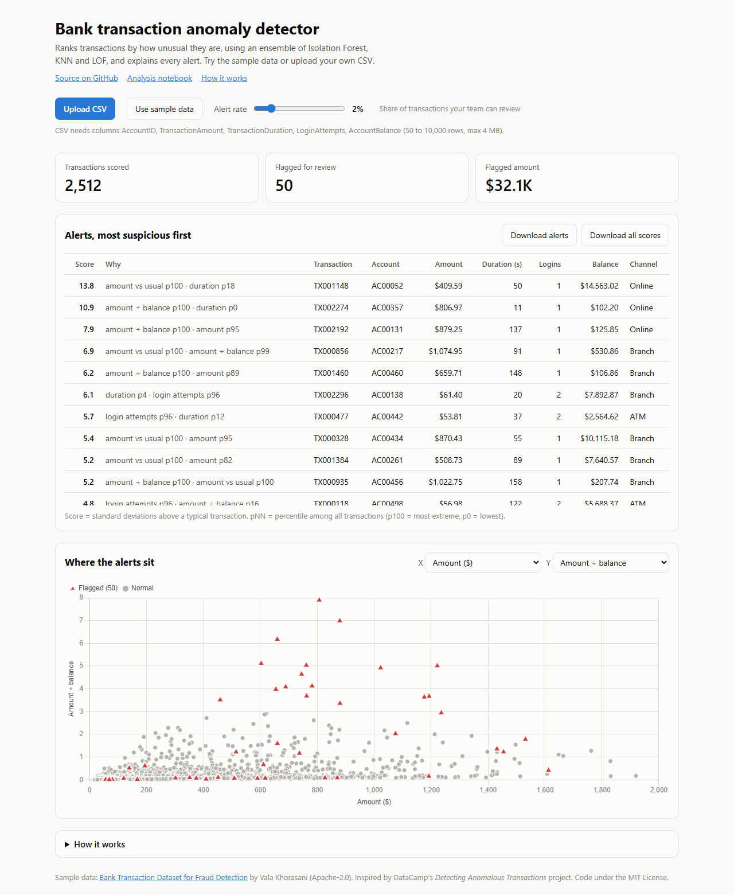
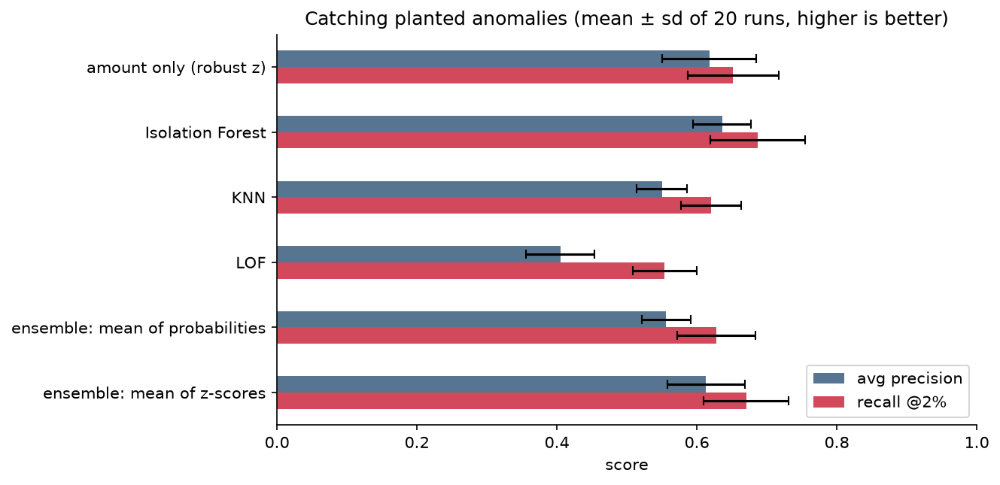

# Bank Transaction Anomaly Detection

[](https://github.com/nightraven4545/bank-transaction-anomaly-detection/actions/workflows/ci.yml)

Find the bank transactions most worth a fraud analyst's time with unsupervised anomaly detection (Isolation Forest, KNN, LOF), attach a reason to every alert, and **measure** how well it works even though the data has no fraud labels.

This is an extended version of DataCamp's guided project [*Detecting Anomalous Transactions*](https://www.datacamp.com/projects/2755).



## Highlights
- **DataCamp project reproduced:** Isolation Forest anomaly scores, then flags, a summary and a histogram ([notebook](notebook.ipynb), Part A).
- **Evaluated without labels:** 27 synthetic frauds of three types are planted into the real data, and the test runs 20 times. The Isolation Forest reaches **ROC-AUC 0.977**, against 0.914 for an amount-only rule.
- **Explainable alerts:** every alert names the two features that make it unusual, for example `amount_to_balance p100, LoginAttempts p96`.
- **Web app on Vercel:** a FastAPI backend and a one-page dashboard. Upload a CSV, set how many alerts your team can review, and download the review queue.
- **Tested:** pytest (detection, API and a check that the scores match PyOD's) and ruff run on every push through GitHub Actions.

## Results

| method | ROC-AUC | avg precision | recall @ 2% alerts |
|---|---|---|---|
| amount only (robust z-score) | 0.914 ± 0.029 | 0.618 ± 0.067 | 0.652 ± 0.065 |
| **Isolation Forest** | **0.977 ± 0.006** | **0.636 ± 0.041** | **0.687 ± 0.067** |
| KNN | 0.968 ± 0.007 | 0.550 ± 0.036 | 0.620 ± 0.043 |
| LOF | 0.901 ± 0.028 | 0.405 ± 0.049 | 0.554 ± 0.046 |
| ensemble: mean of probabilities | 0.971 ± 0.009 | 0.556 ± 0.035 | 0.628 ± 0.056 |
| ensemble: mean of z-scores *(used in the app)* | 0.976 ± 0.007 | 0.613 ± 0.055 | 0.670 ± 0.061 |

Mean ± standard deviation over 20 runs. Each run plants 27 synthetic frauds (~1%) among the 2,512 real transactions: account takeovers, big-ticket purchases and balance drains.



**Key findings**
- **Models beat amount-only rules overall, but not everywhere.** The amount rule catches more big-ticket purchases (70% vs 34%). The models catch more account takeovers (74% vs 43%) and nearly all balance drains. So the model should be paired with a few hard rules.
- **How you combine detectors matters.** Averaging z-scores beats averaging outlier probabilities, because the probabilities bunch up near 1 and tie the top of the ranking.
- **Flag by review capacity, not by a probability cut-off.** "Probability > 0.75" would flag 13% of all transactions. The top 2% is about 50 transactions, which a team can actually review.

## Data
[Bank Transaction Dataset for Fraud Detection](https://www.kaggle.com/datasets/valakhorasani/bank-transaction-dataset-for-fraud-detection) by Vala Khorasani: 2,512 transactions, 16 columns, released under the [Apache License 2.0](data/LICENSE). The file in `data/` is unchanged.

The notebook found three data-quality issues:
- `PreviousTransactionDate` is later than the transaction on every row.
- Transactions only happen between 16:00 and 18:59.
- Device and IP change on almost every transaction.

So the model uses behavioural features only: amount, duration, login attempts, amount ÷ balance, and amount ÷ the account's usual amount. Age and occupation are left out on purpose, so nobody gets flagged for being old or wealthy.

## How it works (`detect.py`)
1. **`add_features`** adds two context ratios: how big the amount is compared with the balance, and compared with the account's own median.
2. **`score`** scales the features with `RobustScaler`, then runs Isolation Forest, KNN and LOF. It uses the scikit-learn estimators that PyOD wraps, so the scores are identical (a test checks this) without PyOD's heavy numba dependency. Each detector's training scores become z-scores, and the ensemble is their mean.
3. **`flag`** marks the top *N*% by score, sized to review capacity.
4. **`explain`** produces reason codes: the two features with the most extreme percentiles.

## Run it
Python 3.11+.

```bash
git clone https://github.com/nightraven4545/bank-transaction-anomaly-detection.git
cd bank-transaction-anomaly-detection
python -m venv .venv
source .venv/bin/activate          # Windows: .venv\Scripts\activate
pip install -r requirements-dev.txt
uvicorn app:app --reload           # dashboard at http://127.0.0.1:8000
pytest -q                          # tests
pip install jupyter
jupyter lab notebook.ipynb         # analysis
```

`requirements.txt` holds only what the web app needs, which keeps the Vercel function small. The notebook and test tools are in `requirements-dev.txt`.

## API
| endpoint | returns |
|---|---|
| `GET /api/sample` | scores for the bundled dataset |
| `POST /api/score` (multipart field `file`, CSV) | scores for your own transactions: 50 to 10,000 rows, at most 4 MB |

Both return `{features, columns, data}`, with one row per transaction including `ensemble` (the anomaly z-score) and `reason`. Uploads are validated (required columns, numeric values, size and row limits) and never stored.

```bash
curl -F "file=@data/bank_transactions_data_2.csv" http://127.0.0.1:8000/api/score
```

## Project structure
```
├── notebook.ipynb      analysis: DataCamp steps (Part A), extensions and evaluation (Part B)
├── detect.py           features, detectors, alerting, reason codes (shared)
├── app.py              FastAPI backend: scoring API, serves the dashboard (Vercel entrypoint)
├── static/index.html   dashboard: upload, alert-rate slider, alerts table, scatter chart
├── test_detect.py      detection tests, including the PyOD equivalence check
├── test_app.py         API tests: sample, uploads, rejected files
├── data/               Kaggle dataset (Apache-2.0)
└── images/             figures used in this README
```

## Limitations
- The data is synthetic and has no labels. The evaluation measures how well the planted patterns are caught, not real-world fraud recall.
- Real anomalies may be hiding among the "normal" rows, so the measured precision is pessimistic.
- Accounts have only about 5 transactions each, so per-account baselines are noisy.

## Next steps
- A time-series view: daily volumes checked with MAD or seasonal decomposition.
- SHAP-based explanations instead of percentile reason codes.
- A benchmark on a labelled dataset, such as the ULB credit-card fraud data.
- Save analysts' verdicts on alerts as labels, so a supervised model can be trained later.

## Credits
- Project idea: DataCamp, *Detecting Anomalous Transactions* (Mike Preble), and the *Anomaly Detection in Python* course.
- Data: Vala Khorasani on Kaggle (Apache-2.0).
- Code: [MIT License](LICENSE).
